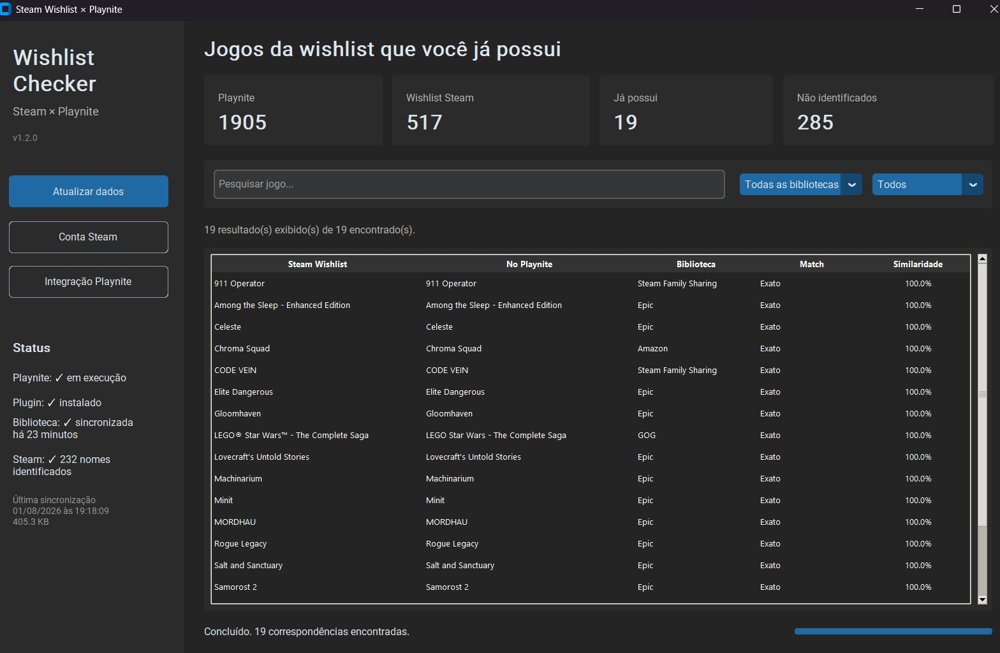
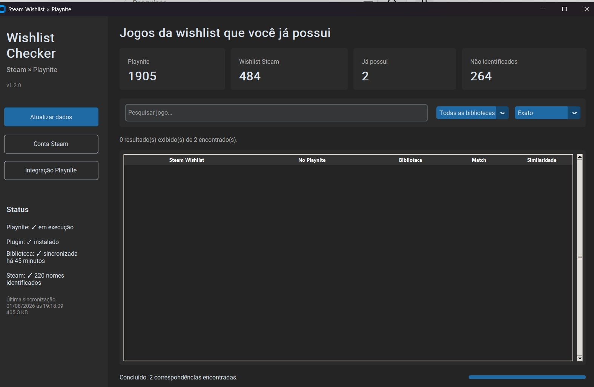

# Steam Wishlist × Playnite

Aplicativo para identificar jogos da sua wishlist da Steam que você já possui em outras bibliotecas cadastradas no Playnite, como Epic Games, GOG, Amazon Games, Xbox, EA app, Battle.net e outras.

## Funcionalidades

- Interface gráfica em modo escuro
- Leitura automática da biblioteca do Playnite
- Integração com Playnite por plugin próprio
- Instalação do plugin diretamente pela interface
- Configuração persistente do SteamID64
- Comparação entre wishlist da Steam e biblioteca do Playnite
- Ignora jogos da própria biblioteca Steam
- Exibe a biblioteca em que o jogo foi encontrado
- Match exato e aproximado
- Filtro por biblioteca
- Filtro por tipo de correspondência
- Pesquisa por nome
- Duplo clique para abrir a página do jogo na Steam
- Executável standalone para Windows

## Resultado na prática

O objetivo do Wishlist Checker é ajudar a encontrar jogos que continuam na sua wishlist da Steam mesmo que você já os possua em outra biblioteca cadastrada no Playnite.

Após executar a comparação, você pode revisar as correspondências encontradas e remover manualmente da wishlist da Steam os jogos que não precisa mais acompanhar.

### Antes

Neste exemplo, a wishlist possuía **517 jogos** e o aplicativo encontrou **19 correspondências** com jogos já presentes em outras bibliotecas.



### Depois

Após revisar os resultados, rodar a conferência mais 2 vezes, remover da wishlist alguns dos jogos já possuídos e executar uma nova verificação, a wishlist passou a ter **484 jogos**, restando apenas **2 correspondências**(inexatas).



> O Wishlist Checker não remove jogos automaticamente da sua conta Steam. O aplicativo apenas identifica possíveis correspondências para que você possa revisá-las e decidir quais itens deseja remover manualmente da wishlist.

## Requisitos

Para usar a versão distribuída:

- Windows
- Playnite instalado
- Conta Steam com wishlist acessível
- Conexão com a internet

Não é necessário instalar Python, Visual Studio ou utilizar o SDK Interativo do Playnite.

## Download

Baixe a versão mais recente na seção **Releases** do GitHub.

Extraia o arquivo ZIP para uma pasta de sua preferência e execute:

```text
WishlistSteamCheck.exe

## Licença

Este projeto é distribuído sob a licença MIT. Consulte o arquivo [LICENSE](LICENSE) para mais detalhes.